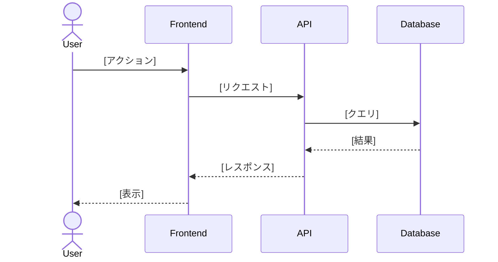

# 技術設計書

**プロジェクト**: [プロジェクト名]
**機能**: [機能名]
**バージョン**: [バージョン番号]
**日付**: [YYYY-MM-DD]
**作成者**: [作成者名]
**ステータス**: [Draft | In Review | Approved | Implemented]

---

## 概要

[設計する機能/システムの簡潔な説明]

**目的**: [どんな問題を解決するか？どんな価値を提供するか？]

**ユーザー**: [誰がこのシステムを使用するか？役割は？]

**影響**: [既存システムやワークフローにどう影響するか？]

### ゴール

- [主要ゴール1]
- [主要ゴール2]
- [主要ゴール3]

### 非ゴール

- [明示的にスコープ外の項目]
- [このデザインに含まれない将来の拡張]
- [関連するが別の関心事]

---

## 前提条件

> **重要**: この設計書を作成する前に、以下の成果物が存在することを確認してください:
> - **要件定義書**: `steering/templates/requirements.md` にEARS形式の受入基準
> - **調査資料** (該当する場合): `steering/templates/research.md` に技術調査
> - **Steeringコンテキスト**: `steering/structure.md`, `steering/tech.md`, `steering/product.md` をレビュー

**要件トレーサビリティ**: この設計は以下の要件に対応します:
- [要件ドキュメントへのリンク、例: `requirements/srs/srs-project-v1.0.md`]

---

## アーキテクチャ

### アーキテクチャパターンと境界マップ

**選択パターン**: [パターン名、例: レイヤードアーキテクチャ、マイクロサービス、イベント駆動]

[このパターンを選んだ理由と要件への適合性の説明]

```mermaid
graph TB
    [ここにアーキテクチャ図を追加]
    [コンポーネント、データフロー、相互作用を示す]
```

**ドメイン境界**:

- **[境界1名]**: [責務とスコープ]
- **[境界2名]**: [責務とスコープ]
- **[境界3名]**: [責務とスコープ]

**既存パターンの保持**:
- [この設計は `steering/structure.md` とどう整合しているか？]
- [どの既存アーキテクチャパターンを維持しているか？]

**新規コンポーネントの理由**:
- **[コンポーネント1]**: [なぜ必要か？どの問題を解決するか？]
- **[コンポーネント2]**: [なぜ必要か？どの問題を解決するか？]

**Steering準拠**:
- ✅ `steering/structure.md` のアーキテクチャパターンに従う
- ✅ `steering/tech.md` の技術スタックを使用
- ✅ `steering/product.md` の製品ゴールと整合

---

## 技術スタック

> **参照**: 承認済み技術については `steering/tech.md` を参照

### コア技術

| コンポーネント | 技術 | バージョン | 選定理由 |
|---------------|------|------------|----------|
| [バックエンドフレームワーク] | [技術] | [バージョン] | [選定理由] |
| [データベース] | [技術] | [バージョン] | [選定理由] |
| [フロントエンド] | [技術] | [バージョン] | [選定理由] |

### ライブラリ・フレームワーク

- **[ライブラリ1]** ([バージョン]): [目的と選定理由]
- **[ライブラリ2]** ([バージョン]): [目的と選定理由]

### インフラストラクチャ

- **ホスティング**: [プラットフォーム、例: AWS, GCP, Azure]
- **CI/CD**: [ツール、例: GitHub Actions, GitLab CI]
- **監視**: [ツール、例: DataDog, Prometheus]

---

## コンポーネント設計

### コンポーネント1: [コンポーネント名]

**目的**: [このコンポーネントは何をするか？]

**責務**:
- [責務1]
- [責務2]

**インターフェース**:

```typescript
// API定義例
interface ComponentAPI {
  method1(param: Type): ReturnType;
  method2(param: Type): ReturnType;
}
```

**要件マッピング**: [REQ-001, REQ-002] → [このコンポーネントが対応する要件]

**依存関係**:
- [コンポーネント/サービスA]: [何に依存し、なぜ]
- [コンポーネント/サービスB]: [何に依存し、なぜ]

**エラーハンドリング**:
- [エラーシナリオ1]: [処理方法]
- [エラーシナリオ2]: [処理方法]

---

### コンポーネント2: [コンポーネント名]

[上記と同じ構造を繰り返し]

---

## データ設計

### データモデル

```typescript
// データモデル例
interface User {
  id: string;
  name: string;
  email: string;
  createdAt: Date;
}
```

### データベーススキーマ

> **参照**: 詳細なER図とDDLは `database-schema-design.md` を参照

**テーブル**:
- **[テーブル1]**: [目的とキーフィールド]
- **[テーブル2]**: [目的とキーフィールド]

**インデックス**:
- **[インデックス1]**: `[カラム]` - [目的とクエリパターン]
- **[インデックス2]**: `[カラム]` - [目的とクエリパターン]

**リレーション**:
- [テーブルA] → [テーブルB]: [リレーション種別と目的]

---

## API設計

> **参照**: 詳細なOpenAPI/GraphQL仕様は `api-specification.md` を参照

### エンドポイント

#### エンドポイント1: [メソッド] /api/[パス]

**目的**: [このエンドポイントは何をするか]

**要件**: [REQ-XXX] ← EARS要件へのリンク

**リクエスト**:
```json
{
  "field1": "string",
  "field2": 123
}
```

**レスポンス** (成功 200):
```json
{
  "result": "success",
  "data": {}
}
```

**レスポンス** (エラー 4xx/5xx):
```json
{
  "error": "error_code",
  "message": "人間が読めるメッセージ"
}
```

**EARS要件マッピング**:
- `WHEN ユーザーがリクエストを送信する, the [System] SHALL [アクション]` → このエンドポイントで実装
- `IF [エラー条件], THEN the [System] SHALL [エラー応答]` → エラーハンドリングロジック

---

## シーケンス図

### ユースケース1: [シナリオ名]

**要件**: [REQ-001, REQ-002] - 特定のEARS受入基準へのリンク



**EARS受入基準の対応**:
1. `WHEN [イベント], the [System] SHALL [応答]` ← 図中のステップX
2. `IF [エラー], THEN the [System] SHALL [エラーハンドリング]` ← 図中のステップY

---

## セキュリティ設計

> **参照**: `steering/rules/security-guidelines.md` (存在する場合)

### 認証・認可

- **認証方式**: [JWT, OAuth, API Key]
- **認可モデル**: [RBAC, ABAC]
- **トークン管理**: [保存、有効期限、リフレッシュ]

### データ保護

- **通信の暗号化**: TLS 1.3
- **保管時の暗号化**: AES-256
- **PII取り扱い**: [マスキング、匿名化戦略]

### 入力検証

- **検証レイヤー**: [どこで検証するか]
- **サニタイゼーション**: [インジェクション攻撃を防ぐ戦略]

**EARS要件**:
- `The [System] SHALL bcrypt（コストファクター12）を使用してパスワードを暗号化する`
- `IF 認証が失敗する, THEN the [System] SHALL 401エラーを返す`

---

## パフォーマンス設計

### パフォーマンス要件

> **参照**: 要件定義書の非機能要件

| メトリクス | 要件 | 設計アプローチ |
|-----------|------|---------------|
| 応答時間 | <200ms (p95) | [キャッシング、インデックス戦略] |
| スループット | X req/sec | [水平スケーリング、ロードバランシング] |
| 同時実行数 | X ユーザー | [コネクションプーリング、非同期処理] |

### 最適化戦略

- **キャッシング**: [何をキャッシュし、どこに、有効期限]
- **データベース最適化**: [インデックス化、クエリ最適化]
- **API最適化**: [ページネーション、フィールドフィルタリング]

**EARS要件マッピング**:
- `The API SHALL 95パーセンタイル要求に対して200ms以内に応答する` → キャッシング層 + インデックス

---

## スケーラビリティ設計

### 水平スケーリング

- **ステートレスサービス**: [どのサービスがステートレスか]
- **ロードバランシング**: [戦略と設定]
- **セッション管理**: [スケール時のセッション処理]

### 垂直スケーリング

- **リソース制限**: [CPU、メモリ制約]
- **ボトルネック分析**: [潜在的なボトルネックと軽減策]

**EARS要件**:
- `The [System] SHALL パフォーマンス低下なくXノードまで水平スケーリングをサポートする`

---

## 可観測性設計

### ログ

- **ログフォーマット**: [JSON構造化ログ]
- **ログレベル**: [INFO, WARN, ERROR, DEBUG]
- **ログ集約**: [ツール、例: ELK, Datadog]

### メトリクス

- **主要メトリクス**: [応答時間、エラー率、スループット]
- **監視ツール**: [Prometheus, Datadog, CloudWatch]
- **アラート**: [閾値と通知チャネル]

### トレーシング

- **分散トレーシング**: [Jaeger, Zipkin, OpenTelemetry]
- **相関ID**: [リクエストの追跡方法]

**EARS要件**:
- `The [System] SHALL 監視用メトリクスエンドポイントを公開する`
- `The [System] SHALL 相関IDでリクエストを追跡する`

---

## エラーハンドリングとレジリエンス

### エラーカテゴリ

| カテゴリ | HTTPステータス | 処理戦略 |
|---------|---------------|----------|
| バリデーションエラー | 400 | [特定のフィールドエラーを返す] |
| 認証エラー | 401 | [汎用メッセージを返す] |
| 認可エラー | 403 | [ログと通知] |
| Not Found | 404 | [空の結果を返す] |
| サーバーエラー | 500 | [ログ、アラート、リトライ] |

### レジリエンスパターン

- **リトライロジック**: [指数バックオフ、最大リトライ回数]
- **サーキットブレーカー**: [失敗閾値、タイムアウト]
- **タイムアウト**: [接続タイムアウト、リクエストタイムアウト]

**EARS要件**:
- `IF データベース接続が失敗する, THEN the [System] SHALL 指数バックオフでリトライする`
- `IF LLM APIが利用不可である, THEN the [System] SHALL retry-afterヘッダー付き503エラーを返す`

---

## テスト戦略

> **参照**: Test Engineerがこの設計に基づいて詳細なテスト計画を作成

### ユニットテスト

- **カバレッジ目標**: 80%以上
- **テスト対象の主要コンポーネント**: [重要コンポーネントのリスト]

### 統合テスト

- **統合ポイント**: [API、データベース、外部サービス]
- **テストシナリオ**: [正常系、エラー系、エッジケース]

### E2Eテスト

- **ユーザーフロー**: [要件からの主要ユーザーシナリオ]
- **ツール**: [Cypress, Playwright, Selenium]

**EARSからテストへのマッピング**:
- 各EARS受入基準が特定のテストケースにマッピングされる
- Test Engineerがこの設計を参照してテスト実装

---

## デプロイ戦略

### 環境

- **Development**: [設定と目的]
- **Staging**: [設定と目的]
- **Production**: [設定と目的]

### デプロイプロセス

1. [ステップ1]
2. [ステップ2]
3. [ステップ3]

### ロールバック計画

- **トリガー条件**: [いつロールバックするか]
- **ロールバックプロセス**: [どうやって戻すか]
- **復旧時間**: [目標RTO]

---

## 移行・ロールアウト計画

### フェーズ1: [フェーズ名]

- **スコープ**: [含まれる内容]
- **期間**: [タイムライン]
- **成功基準**: [成功をどう測定するか]

### フェーズ2: [フェーズ名]

[上記と同じ構造を繰り返し]

### ロールバック戦略

[問題が発生した場合の安全なロールバック方法]

---

## 検討した代替案

### 代替案1: [代替アプローチ]

**利点**:
- [利点1]
- [利点2]

**欠点**:
- [欠点1]
- [欠点2]

**判断**: ❌ 不採用 理由: [理由]

---

### 代替案2: [代替アプローチ]

[上記と同じ構造を繰り返し]

---

## 未解決の質問とリスク

### 未解決の質問

- ❓ [質問1]
- ❓ [質問2]

### リスク

| リスク | 影響 | 確率 | 軽減策 |
|-------|------|------|--------|
| [リスク1] | 高 | 中 | [軽減戦略] |
| [リスク2] | 低 | 高 | [軽減戦略] |

---

## 依存関係

### 内部依存

- [依存1]: [何が必要で、なぜ]
- [依存2]: [何が必要で、なぜ]

### 外部依存

- [サービス/API 1]: [何が必要で、いつ]
- [サービス/API 2]: [何が必要で、いつ]

---

## 将来の検討事項

### フェーズ2の拡張

- [拡張1]
- [拡張2]

### 技術的負債

- [既知の技術的負債1]
- [既知の技術的負債2]

---

## 承認

| 役割 | 氏名 | 署名 | 日付 |
|------|------|------|------|
| システムアーキテクト | | | |
| テックリード | | | |
| セキュリティレビュアー | | | |
| パフォーマンスレビュアー | | | |

---

## 参照ドキュメント

- **要件定義書**: `[要件ドキュメントへのパス]`
- **調査資料**: `[調査ドキュメントへのパス]` (該当する場合)
- **API仕様**: `[API仕様へのパス]`
- **データベーススキーマ**: `[スキーマ設計へのパス]`
- **Steeringコンテキスト**:
  - `steering/structure.md` - アーキテクチャパターン
  - `steering/tech.md` - 技術スタック
  - `steering/product.md` - 製品コンテキスト
  - `steering/rules/ears-format.md` - 要件形式

---

## ドキュメント管理

| バージョン | 日付 | 作成者 | 変更内容 |
|-----------|------|--------|----------|
| 1.0 | YYYY-MM-DD | [氏名] | 初版設計 |

---

## 付録A: 用語集

| 用語 | 定義 |
|------|------|
| [用語1] | [定義] |
| [用語2] | [定義] |

---

## 付録B: EARS要件クロスリファレンス

### イベント駆動要件 (WHEN)

| EARS要件 | 設計コンポーネント | 実装ノート |
|---------|------------------|-----------|
| WHEN [イベント], the [System] SHALL [アクション] | [コンポーネント名] | [実装方法] |

### エラーハンドリング要件 (IF...THEN)

| EARS要件 | 設計コンポーネント | エラーハンドリング戦略 |
|---------|------------------|---------------------|
| IF [エラー], THEN the [System] SHALL [応答] | [コンポーネント名] | [エラー処理アプローチ] |

### 普遍的要件 (SHALL)

| EARS要件 | 設計コンポーネント | 実装ノート |
|---------|------------------|-----------|
| The [System] SHALL [アクション] | [コンポーネント名] | [常に適用される方法] |
