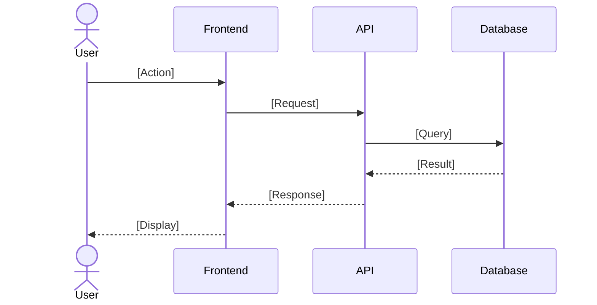

# Technical Design Document

**Project**: [Project Name]
**Feature**: [Feature Name]
**Version**: [Version Number]
**Date**: [YYYY-MM-DD]
**Author**: [Author Name]
**Status**: [Draft | In Review | Approved | Implemented]

---

## Overview

[Brief description of the feature/system being designed]

**Purpose**: [What problem does this solve? What value does it provide?]

**Users**: [Who will use this system? What are their roles?]

**Impact**: [How does this change existing systems or workflows?]

### Goals

- [Primary goal 1]
- [Primary goal 2]
- [Primary goal 3]

### Non-Goals

- [What is explicitly out of scope]
- [Future enhancements not included in this design]
- [Related but separate concerns]

---

## Prerequisites

> **IMPORTANT**: Before creating this design document, ensure these artifacts exist:
> - **Requirements Document**: `steering/templates/requirements.md` with EARS-format acceptance criteria
> - **Research Document** (if applicable): `steering/templates/research.md` with technical explorations
> - **Steering Context**: Review `steering/structure.md`, `steering/tech.md`, `steering/product.md`

**Requirements Traceability**: This design addresses requirements documented in:
- [Link to requirements document, e.g., `requirements/srs/srs-project-v1.0.md`]

---

## Architecture

### Architecture Pattern & Boundary Map

**Selected Pattern**: [Pattern Name, e.g., Layered Architecture, Microservices, Event-Driven]

[Explanation of why this pattern was chosen and how it fits the requirements]

```mermaid
graph TB
    [Add architecture diagram here]
    [Show components, data flow, and interactions]
```

**Domain Boundaries**:

- **[Boundary 1 Name]**: [Responsibilities and scope]
- **[Boundary 2 Name]**: [Responsibilities and scope]
- **[Boundary 3 Name]**: [Responsibilities and scope]

**Existing Patterns Preserved**:
- [How does this design align with `steering/structure.md`?]
- [Which existing architectural patterns are maintained?]

**New Components Rationale**:
- **[Component 1]**: [Why is this needed? What problem does it solve?]
- **[Component 2]**: [Why is this needed? What problem does it solve?]

**Steering Compliance**:
- ✅ Follows architecture patterns in `steering/structure.md`
- ✅ Uses technology stack from `steering/tech.md`
- ✅ Aligns with product goals in `steering/product.md`

---

## Technology Stack

> **Reference**: `steering/tech.md` for approved technologies

### Core Technologies

| Component | Technology | Version | Rationale |
|-----------|------------|---------|-----------|
| [Backend Framework] | [Technology] | [Version] | [Why chosen] |
| [Database] | [Technology] | [Version] | [Why chosen] |
| [Frontend] | [Technology] | [Version] | [Why chosen] |

### Libraries & Frameworks

- **[Library 1]** ([Version]): [Purpose and why chosen]
- **[Library 2]** ([Version]): [Purpose and why chosen]

### Infrastructure

- **Hosting**: [Platform, e.g., AWS, GCP, Azure]
- **CI/CD**: [Tools, e.g., GitHub Actions, GitLab CI]
- **Monitoring**: [Tools, e.g., DataDog, Prometheus]

---

## Component Design

### Component 1: [Component Name]

**Purpose**: [What does this component do?]

**Responsibilities**:
- [Responsibility 1]
- [Responsibility 2]

**Interfaces**:

```typescript
// Example API definition
interface ComponentAPI {
  method1(param: Type): ReturnType;
  method2(param: Type): ReturnType;
}
```

**Requirements Mapped**: [REQ-001, REQ-002] → [Requirements this component addresses]

**Dependencies**:
- [Component/Service A]: [What it depends on and why]
- [Component/Service B]: [What it depends on and why]

**Error Handling**:
- [Error scenario 1]: [How it's handled]
- [Error scenario 2]: [How it's handled]

---

### Component 2: [Component Name]

[Repeat structure above]

---

## Data Design

### Data Models

```typescript
// Example data model
interface User {
  id: string;
  name: string;
  email: string;
  createdAt: Date;
}
```

### Database Schema

> **Reference**: See `database-schema-design.md` for detailed ER diagrams and DDL

**Tables**:
- **[Table 1]**: [Purpose and key fields]
- **[Table 2]**: [Purpose and key fields]

**Indexes**:
- **[Index 1]**: `[columns]` - [Purpose and query patterns]
- **[Index 2]**: `[columns]` - [Purpose and query patterns]

**Relationships**:
- [Table A] → [Table B]: [Relationship type and purpose]

---

## API Design

> **Reference**: See `api-specification.md` for detailed OpenAPI/GraphQL specs

### Endpoints

#### Endpoint 1: [Method] /api/[path]

**Purpose**: [What this endpoint does]

**Requirements**: [REQ-XXX] ← Links to EARS requirements

**Request**:
```json
{
  "field1": "string",
  "field2": 123
}
```

**Response** (Success 200):
```json
{
  "result": "success",
  "data": {}
}
```

**Response** (Error 4xx/5xx):
```json
{
  "error": "error_code",
  "message": "Human-readable message"
}
```

**EARS Requirements Mapping**:
- `WHEN user submits request, the [System] SHALL [action]` → Implemented by this endpoint
- `IF [error condition], THEN the [System] SHALL [error response]` → Error handling logic

---

## Sequence Diagrams

### Use Case 1: [Scenario Name]

**Requirements**: [REQ-001, REQ-002] - Links to specific EARS acceptance criteria



**EARS Acceptance Criteria Addressed**:
1. `WHEN [event], the [System] SHALL [response]` ← Step X in diagram
2. `IF [error], THEN the [System] SHALL [error handling]` ← Step Y in diagram

---

## Security Design

> **Reference**: `steering/rules/security-guidelines.md` (if exists)

### Authentication & Authorization

- **Authentication Method**: [JWT, OAuth, API Key]
- **Authorization Model**: [RBAC, ABAC]
- **Token Management**: [Storage, expiration, refresh]

### Data Protection

- **Encryption in Transit**: TLS 1.3
- **Encryption at Rest**: AES-256
- **PII Handling**: [Masking, anonymization strategies]

### Input Validation

- **Validation Layer**: [Where validation occurs]
- **Sanitization**: [Strategies to prevent injection attacks]

**EARS Requirements**:
- `The [System] SHALL encrypt passwords using bcrypt with cost factor 12`
- `IF authentication fails, THEN the [System] SHALL return 401 error`

---

## Performance Design

### Performance Requirements

> **Reference**: Non-functional requirements from requirements document

| Metric | Requirement | Design Approach |
|--------|-------------|-----------------|
| Response Time | <200ms (p95) | [Caching, indexing strategy] |
| Throughput | X req/sec | [Horizontal scaling, load balancing] |
| Concurrency | X users | [Connection pooling, async processing] |

### Optimization Strategies

- **Caching**: [What is cached, where, expiration]
- **Database Optimization**: [Indexing, query optimization]
- **API Optimization**: [Pagination, field filtering]

**EARS Requirements Mapped**:
- `The API SHALL respond within 200ms for 95th percentile requests` → Caching layer + indexes

---

## Scalability Design

### Horizontal Scaling

- **Stateless Services**: [Which services are stateless]
- **Load Balancing**: [Strategy and configuration]
- **Session Management**: [How sessions are handled at scale]

### Vertical Scaling

- **Resource Limits**: [CPU, memory constraints]
- **Bottleneck Analysis**: [Potential bottlenecks and mitigation]

**EARS Requirements**:
- `The [System] SHALL support horizontal scaling to X nodes without performance degradation`

---

## Observability Design

### Logging

- **Log Format**: [JSON structured logs]
- **Log Levels**: [INFO, WARN, ERROR, DEBUG]
- **Log Aggregation**: [Tool, e.g., ELK, Datadog]

### Metrics

- **Key Metrics**: [Response time, error rate, throughput]
- **Monitoring Tool**: [Prometheus, Datadog, CloudWatch]
- **Alerting**: [Thresholds and notification channels]

### Tracing

- **Distributed Tracing**: [Jaeger, Zipkin, OpenTelemetry]
- **Correlation IDs**: [How requests are tracked]

**EARS Requirements**:
- `The [System] SHALL expose metrics endpoint for monitoring`
- `The [System] SHALL trace requests with correlation ID`

---

## Error Handling & Resilience

### Error Categories

| Category | HTTP Status | Handling Strategy |
|----------|-------------|-------------------|
| Validation Errors | 400 | [Return specific field errors] |
| Authentication | 401 | [Return generic message] |
| Authorization | 403 | [Log and notify] |
| Not Found | 404 | [Return empty result] |
| Server Errors | 500 | [Log, alert, retry] |

### Resilience Patterns

- **Retry Logic**: [Exponential backoff, max retries]
- **Circuit Breaker**: [Failure threshold, timeout]
- **Timeouts**: [Connection timeout, request timeout]

**EARS Requirements**:
- `IF database connection fails, THEN the [System] SHALL retry with exponential backoff`
- `IF LLM API is unavailable, THEN the [System] SHALL return 503 error with retry-after header`

---

## Testing Strategy

> **Reference**: Test Engineer will create detailed test plans based on this design

### Unit Testing

- **Coverage Target**: 80%+
- **Key Components to Test**: [List critical components]

### Integration Testing

- **Integration Points**: [APIs, database, external services]
- **Test Scenarios**: [Happy path, error cases, edge cases]

### E2E Testing

- **User Flows**: [Key user scenarios from requirements]
- **Tools**: [Cypress, Playwright, Selenium]

**EARS-to-Test Mapping**:
- Each EARS acceptance criterion maps to specific test cases
- Test Engineer will reference this design for test implementation

---

## Deployment Strategy

### Environments

- **Development**: [Configuration and purpose]
- **Staging**: [Configuration and purpose]
- **Production**: [Configuration and purpose]

### Deployment Process

1. [Step 1]
2. [Step 2]
3. [Step 3]

### Rollback Plan

- **Trigger Conditions**: [When to rollback]
- **Rollback Process**: [How to revert]
- **Recovery Time**: [Target RTO]

---

## Migration & Rollout Plan

### Phase 1: [Phase Name]

- **Scope**: [What is included]
- **Duration**: [Timeline]
- **Success Criteria**: [How to measure success]

### Phase 2: [Phase Name]

[Repeat structure]

### Rollback Strategy

[How to safely rollback if issues occur]

---

## Alternatives Considered

### Alternative 1: [Alternative Approach]

**Pros**:
- [Advantage 1]
- [Advantage 2]

**Cons**:
- [Disadvantage 1]
- [Disadvantage 2]

**Decision**: ❌ Not selected because [reason]

---

### Alternative 2: [Alternative Approach]

[Repeat structure]

---

## Open Questions & Risks

### Open Questions

- ❓ [Question 1]
- ❓ [Question 2]

### Risks

| Risk | Impact | Probability | Mitigation |
|------|--------|-------------|------------|
| [Risk 1] | High | Medium | [Mitigation strategy] |
| [Risk 2] | Low | High | [Mitigation strategy] |

---

## Dependencies

### Internal Dependencies

- [Dependency 1]: [What is needed and why]
- [Dependency 2]: [What is needed and why]

### External Dependencies

- [Service/API 1]: [What is needed and when]
- [Service/API 2]: [What is needed and when]

---

## Future Considerations

### Phase 2 Enhancements

- [Enhancement 1]
- [Enhancement 2]

### Technical Debt

- [Known technical debt item 1]
- [Known technical debt item 2]

---

## Approval

| Role | Name | Signature | Date |
|------|------|-----------|------|
| System Architect | | | |
| Tech Lead | | | |
| Security Reviewer | | | |
| Performance Reviewer | | | |

---

## References

- **Requirements**: `[path to requirements document]`
- **Research**: `[path to research document]` (if applicable)
- **API Specification**: `[path to API spec]`
- **Database Schema**: `[path to schema design]`
- **Steering Context**:
  - `steering/structure.md` - Architecture patterns
  - `steering/tech.md` - Technology stack
  - `steering/product.md` - Product context
  - `steering/rules/ears-format.md` - Requirements format

---

## Document Control

| Version | Date | Author | Changes |
|---------|------|--------|---------|
| 1.0 | YYYY-MM-DD | [Name] | Initial design |

---

## Appendix A: Glossary

| Term | Definition |
|------|------------|
| [Term 1] | [Definition] |
| [Term 2] | [Definition] |

---

## Appendix B: EARS Requirements Cross-Reference

### Event-Driven Requirements (WHEN)

| EARS Requirement | Design Component | Implementation Notes |
|------------------|------------------|----------------------|
| WHEN [event], the [System] SHALL [action] | [Component name] | [How it's implemented] |

### Error Handling Requirements (IF...THEN)

| EARS Requirement | Design Component | Error Handling Strategy |
|------------------|------------------|-------------------------|
| IF [error], THEN the [System] SHALL [response] | [Component name] | [Error handling approach] |

### Ubiquitous Requirements (SHALL)

| EARS Requirement | Design Component | Implementation Notes |
|------------------|------------------|----------------------|
| The [System] SHALL [action] | [Component name] | [How it's always enforced] |
