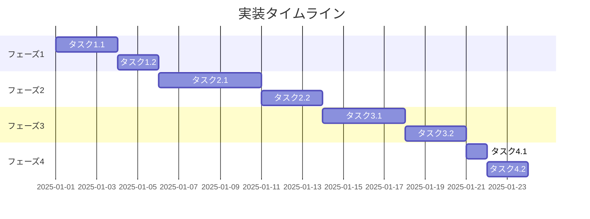

# 実装計画 / タスク

**プロジェクト**: [プロジェクト名]
**機能**: [機能名]
**日付**: [YYYY-MM-DD]
**作成者**: [作成者名]
**ステータス**: [未着手 | 進行中 | 完了]

---

## 概要

この実装計画は、機能を具体的で実行可能なタスクに分解し、明確な担当、優先度、要件トレーサビリティを提供します。

### 前提条件

> **重要**: このタスクドキュメントを作成する前に、以下の成果物が存在することを確認してください:
> - **要件定義書**: EARS形式の受入基準を含む
> - **設計書**: 技術アーキテクチャとコンポーネント設計
> - **Steeringコンテキスト**: `steering/structure.md`, `steering/tech.md`, `steering/product.md`

**トレーサビリティ**:
- 要件: `[要件ドキュメントへのパス]`
- 設計: `[設計ドキュメントへのパス]`

---

## タスクステータス凡例

- **[ ]** 未着手
- **[IP]** 進行中
- **[✓]** 完了
- **[X]** ブロック中
- **[~]** キャンセル/延期

**優先度**:
- **(P)** 優先 / クリティカルパス - 最初に完了必須
- **(H)** 高 - 重要だがブロッキングではない
- **(M)** 中 - あると良い
- **(L)** 低 - 延期可能

---

## 進捗サマリー

| フェーズ | 全タスク | 完了 | 進行中 | ブロック | 進捗率 |
|---------|---------|------|--------|---------|--------|
| フェーズ1 | X | Y | Z | 0 | XX% |
| フェーズ2 | X | Y | Z | 0 | XX% |
| フェーズ3 | X | Y | Z | 0 | XX% |
| **合計** | **X** | **Y** | **Z** | **0** | **XX%** |

**最終更新**: [YYYY-MM-DD HH:MM]

---

## フェーズ1: [フェーズ名 - 例: 基盤構築・セットアップ]

**目的**: [このフェーズで何を達成するか？]

**期間**: [予想時間]

**依存関係**: [このフェーズの前に完了すべきこと]

---

### 1.1 (P) [タスクタイトル]

**説明**: [詳細なタスク説明]

**受入基準** (EARS準拠):
- WHEN [条件], the [システム] SHALL [結果] ← [REQ-XXX]
- The [システム] SHALL [要件] ← [REQ-YYY]

**サブタスク**:
- [ ] [サブタスク1]
- [ ] [サブタスク2]
- [ ] [サブタスク3]

**マッピングされた要件**: [REQ-001, REQ-003, REQ-005]

**設計参照**:
- [design.md のコンポーネントA]
- [design.md のAPIエンドポイントB]

**依存関係**: なし / [タスクX.Xを先に完了]

**見積工数**: [時間/日数]

**担当者**: [氏名/チーム]

**ステータス**: [ ] 未着手

**備考**: [追加コンテキスト、注意点、重要な考慮事項]

---

### 1.2 (H) [タスクタイトル]

[上記と同じ構造を繰り返し]

---

## フェーズ2: [フェーズ名 - 例: コア実装]

**目的**: [このフェーズで何を達成するか？]

**期間**: [予想時間]

**依存関係**: フェーズ1完了

---

### 2.1 (P) [タスクタイトル]

**説明**: [詳細なタスク説明]

**受入基準** (EARS準拠):
- WHEN [トリガー], the [システム] SHALL [応答] ← [REQ-XXX]
- IF [エラー条件], THEN the [システム] SHALL [エラーハンドリング] ← [REQ-YYY]

**サブタスク**:
- [ ] [サブタスク1]
- [ ] [サブタスク2]

**マッピングされた要件**: [REQ-XXX, REQ-YYY]

**設計参照**:
- [design.md のセクション]

**依存関係**: [タスク1.X]

**見積工数**: [時間/日数]

**担当者**: [氏名/チーム]

**ステータス**: [ ] 未着手

---

### 2.2 (H) [タスクタイトル]

[構造を繰り返し]

---

## フェーズ3: [フェーズ名 - 例: テスト・品質保証]

**目的**: 包括的テストですべての要件が満たされていることを検証

**期間**: [予想時間]

**依存関係**: フェーズ2完了

---

### 3.1 (P) ユニットテスト実装

**説明**: すべてのコアコンポーネントのユニットテストを実装

**受入基準**:
- テストカバレッジは少なくとも80%であること
- すべてのEARS要件に対応するユニットテストがあること
- 要件で特定されたすべてのエッジケースがテストされていること

**サブタスク**:
- [ ] [コンポーネントA]のテスト - [REQ-001, REQ-002] をカバー
- [ ] [コンポーネントB]のテスト - [REQ-003, REQ-004] をカバー
- [ ] [コンポーネントC]のテスト - [REQ-005, REQ-006] をカバー
- [ ] カバレッジが80%の閾値を満たすことを確認

**マッピングされた要件**: [ALL] - テストがすべての要件を検証

**テスト-要件マッピング**:
- `WHEN [イベント], システム SHALL [アクション]` → `test_when_event_occurs()`
- `IF [エラー], THEN システム SHALL [応答]` → `test_error_handling()`

**依存関係**: タスク2.x (すべてのコア実装)

**見積工数**: [日数]

**担当者**: [テストエンジニア]

**ステータス**: [ ] 未着手

---

### 3.2 (P) 統合テスト

**説明**: コンポーネント間および外部サービスとの相互作用をテスト

**受入基準**:
- すべてのAPIエンドポイントが統合テストされていること
- 外部サービスのモック/スタブが実装されていること
- データベーストランザクションがエンドツーエンドでテストされていること

**サブタスク**:
- [ ] API統合テスト - [REQ-XXX] をカバー
- [ ] データベース統合テスト - [REQ-YYY] をカバー
- [ ] 外部サービス統合テスト - [REQ-ZZZ] をカバー

**マッピングされた要件**: [REQ-XXX, REQ-YYY, REQ-ZZZ]

**依存関係**: タスク3.1

**見積工数**: [日数]

**担当者**: [テストエンジニア]

**ステータス**: [ ] 未着手

---

### 3.3 (H) E2Eテスト

**説明**: 要件から完全なユーザーフローをテスト

**受入基準**:
- すべてのユーザーストーリーがE2Eテストカバレッジを持つこと
- クリティカルパスがCI/CDでテストされること
- テストがステージング環境で実行されること

**サブタスク**:
- [ ] ユーザーフロー1: [説明] - [US-001] をカバー
- [ ] ユーザーフロー2: [説明] - [US-002] をカバー
- [ ] ユーザーフロー3: [説明] - [US-003] をカバー

**マッピングされた要件**: [US-001, US-002, US-003]

**依存関係**: タスク3.2

**見積工数**: [日数]

**担当者**: [QAエンジニア]

**ステータス**: [ ] 未着手

---

## フェーズ4: [フェーズ名 - 例: デプロイ・監視]

**目的**: 可観測性を持って本番環境にデプロイ

**期間**: [予想時間]

**依存関係**: フェーズ3完了 (すべてのテストパス)

---

### 4.1 (P) 本番デプロイ

**説明**: 本番環境にデプロイ

**受入基準**:
- ゼロダウンタイムデプロイが実行されること
- ロールバック計画がテストされ準備完了していること
- ヘルスチェックがデプロイ成功を確認すること

**サブタスク**:
- [ ] ステージングにデプロイして検証
- [ ] ステージングでスモークテスト実行
- [ ] 本番にデプロイ
- [ ] ヘルスチェック確認
- [ ] 24時間監視

**マッピングされた要件**: [NFR-Deployment]

**依存関係**: すべてのフェーズ3タスク

**見積工数**: [時間]

**担当者**: [DevOpsエンジニア]

**ステータス**: [ ] 未着手

---

### 4.2 (H) 監視・アラート設定

**説明**: 本番監視を設定

**受入基準**:
- メトリクスダッシュボードが作成されていること
- 重大エラーのアラートが設定されていること
- ログが集約され検索可能であること

**サブタスク**:
- [ ] メトリクス設定 (応答時間、エラー率、スループット)
- [ ] アラート設定 (エラー率>5%、応答時間>3s)
- [ ] ログ集約設定
- [ ] 監視ダッシュボード作成

**マッピングされた要件**: [REQ-Observability]

**依存関係**: タスク4.1

**見積工数**: [時間]

**担当者**: [DevOpsエンジニア]

**ステータス**: [ ] 未着手

---

## 要件カバレッジマトリクス

このマトリクスは、すべての要件に少なくとも1つの実装タスクがあることを保証します。

| 要件ID | EARS要件サマリー | 実装タスク | ステータス |
|--------|-----------------|-----------|-----------|
| REQ-001 | WHEN ユーザーが送信をクリックする, システム SHALL 検証する | 2.1, 3.1 | [ ] |
| REQ-002 | IF 検証が失敗する, THEN システム SHALL エラーを表示する | 2.2, 3.1 | [ ] |
| REQ-003 | The システム SHALL bcryptでパスワードを暗号化する | 2.3, 3.1 | [ ] |
| REQ-004 | WHILE データ読み込み中である, システム SHALL スピナーを表示する | 2.4, 3.2 | [ ] |
| ... | ... | ... | ... |

**カバレッジ**: X/Y 要件 (XX%) が実装タスクを持つ

**カバーされていない要件** (タスクが必要):
- [タスクのない要件をリスト]

---

## ブロックされたタスク

| タスクID | タイトル | ブロック要因 | 解決計画 | ETA |
|---------|---------|------------|---------|-----|
| [X.X] | [タイトル] | [ブロッカー説明] | [解除方法] | [日付] |

---

## リスクと軽減策

| リスク | 影響 | 確率 | 軽減戦略 | 担当者 |
|-------|------|------|---------|-------|
| [リスク1] | 高 | 中 | [軽減方法] | [氏名] |
| [リスク2] | 中 | 高 | [軽減方法] | [氏名] |

---

## 変更ログ

| 日付 | タスクID | 変更説明 | 変更者 |
|------|---------|---------|--------|
| YYYY-MM-DD | X.X | [説明] | [氏名] |

---

## チーム割り当て

| チームメンバー | 割り当てタスク | 総工数 |
|-------------|--------------|--------|
| [氏名1] | [1.1, 1.3, 2.1] | [X日] |
| [氏名2] | [1.2, 2.2, 2.3] | [Y日] |
| [氏名3] | [3.1, 3.2, 3.3] | [Z日] |

---

## タイムライン



---

## デイリースタンドアップテンプレート

**日付**: [YYYY-MM-DD]

**昨日**:
- [タスクX.X] - 完了/進行中
- ブロック: [タスクY.Y] - [ブロッカー説明]

**今日**:
- 作業予定: [タスクZ.Z]

**ブロッカー**:
- [ブロッカーの説明]

---

## 完了の定義 (DoD)

タスクは以下の条件を満たしたとき「完了」とみなされます:

- [ ] すべてのサブタスク完了
- [ ] コードレビュー承認済み
- [ ] ユニットテスト作成・パス (80%以上カバレッジ)
- [ ] 統合テストパス
- [ ] ドキュメント更新済み
- [ ] EARS要件検証済み
- [ ] 重大バグなし
- [ ] ステージングにデプロイ済み
- [ ] プロダクトオーナー承認

---

## メモ・学び

### 技術的判断

- [日付] - [決定内容と理由]
- [日付] - [決定内容と理由]

### 学んだこと

- [うまくいったこと]
- [改善できること]
- [次回避けること]

---

## 参照ドキュメント

- **要件**: `[requirements.mdへのパス]`
- **設計**: `[design.mdへのパス]`
- **EARS形式**: `steering/rules/ears-format.md`
- **Steeringコンテキスト**:
  - `steering/structure.md` - アーキテクチャパターン
  - `steering/tech.md` - 技術スタック
  - `steering/product.md` - 製品ゴール

---

## 付録A: タスクテンプレート

新しいタスクを追加するときはこのテンプレートを使用:

```markdown
### X.X (P/H/M/L) [タスクタイトル]

**説明**: [何をする必要があるか]

**受入基準** (EARS準拠):
- [EARS要件1] ← [REQ-XXX]
- [EARS要件2] ← [REQ-YYY]

**サブタスク**:
- [ ] [サブタスク1]
- [ ] [サブタスク2]

**マッピングされた要件**: [REQ-XXX, REQ-YYY]

**設計参照**: [design.md のセクション]

**依存関係**: [他のタスク]

**見積工数**: [時間/日数]

**担当者**: [氏名]

**ステータス**: [ ] 未着手

**備考**: [追加コンテキスト]
```

---

## 付録B: EARSからテストへのマッピングガイド

| EARSパターン | テスト種別 | テスト例 |
|-------------|----------|---------|
| WHEN [イベント], システム SHALL [アクション] | ユニット/統合 | `test_when_event_then_action()` |
| WHILE [状態], システム SHALL [振る舞い] | 統合/E2E | `test_behavior_during_state()` |
| IF [エラー], THEN システム SHALL [応答] | ユニット/統合 | `test_error_handling()` |
| WHERE [機能], システム SHALL [能力] | 統合/E2E | `test_feature_enabled()` |
| The システム SHALL [要件] | ユニット/統合/E2E | `test_always_active_requirement()` |
