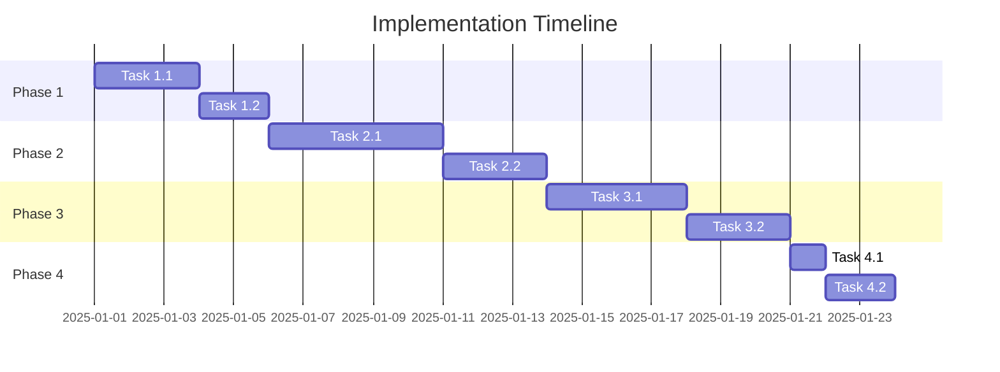

# Implementation Plan / Tasks

**Project**: [Project Name]
**Feature**: [Feature Name]
**Date**: [YYYY-MM-DD]
**Author**: [Author Name]
**Status**: [Not Started | In Progress | Completed]

---

## Overview

This implementation plan breaks down the feature into concrete, actionable tasks with clear ownership, priorities, and requirements traceability.

### Prerequisites

> **IMPORTANT**: Before creating this task document, ensure these artifacts exist:
> - **Requirements Document**: With EARS-format acceptance criteria
> - **Design Document**: Technical architecture and component design
> - **Steering Context**: `steering/structure.md`, `steering/tech.md`, `steering/product.md`

**Traceability**:
- Requirements: `[path to requirements document]`
- Design: `[path to design document]`

---

## Task Status Legend

- **[ ]** Not Started
- **[IP]** In Progress
- **[✓]** Completed
- **[X]** Blocked
- **[~]** Cancelled/Deferred

**Priority**:
- **(P)** Priority / Critical Path - Must complete first
- **(H)** High - Important but not blocking
- **(M)** Medium - Nice to have
- **(L)** Low - Can be deferred

---

## Progress Summary

| Phase | Total Tasks | Completed | In Progress | Blocked | Progress |
|-------|-------------|-----------|-------------|---------|----------|
| Phase 1 | X | Y | Z | 0 | XX% |
| Phase 2 | X | Y | Z | 0 | XX% |
| Phase 3 | X | Y | Z | 0 | XX% |
| **Total** | **X** | **Y** | **Z** | **0** | **XX%** |

**Last Updated**: [YYYY-MM-DD HH:MM]

---

## Phase 1: [Phase Name - e.g., Foundation & Setup]

**Objective**: [What does this phase achieve?]

**Duration**: [Estimated time]

**Dependencies**: [What must be completed before this phase?]

---

### 1.1 (P) [Task Title]

**Description**: [Detailed task description]

**Acceptance Criteria** (EARS-based):
- WHEN [condition], the [System] SHALL [outcome] ← [REQ-XXX]
- The [System] SHALL [requirement] ← [REQ-YYY]

**Subtasks**:
- [ ] [Subtask 1]
- [ ] [Subtask 2]
- [ ] [Subtask 3]

**Requirements Mapped**: [REQ-001, REQ-003, REQ-005]

**Design References**:
- [Component A in design.md]
- [API Endpoint B in design.md]

**Dependencies**: None / [Task X.X must be completed first]

**Estimated Effort**: [Hours/Days]

**Assignee**: [Name/Team]

**Status**: [ ] Not Started

**Notes**: [Additional context, gotchas, or important considerations]

---

### 1.2 (H) [Task Title]

[Repeat structure above]

---

## Phase 2: [Phase Name - e.g., Core Implementation]

**Objective**: [What does this phase achieve?]

**Duration**: [Estimated time]

**Dependencies**: Phase 1 completion

---

### 2.1 (P) [Task Title]

**Description**: [Detailed task description]

**Acceptance Criteria** (EARS-based):
- WHEN [trigger], the [System] SHALL [response] ← [REQ-XXX]
- IF [error condition], THEN the [System] SHALL [error handling] ← [REQ-YYY]

**Subtasks**:
- [ ] [Subtask 1]
- [ ] [Subtask 2]

**Requirements Mapped**: [REQ-XXX, REQ-YYY]

**Design References**:
- [Section in design.md]

**Dependencies**: [Task 1.X]

**Estimated Effort**: [Hours/Days]

**Assignee**: [Name/Team]

**Status**: [ ] Not Started

---

### 2.2 (H) [Task Title]

[Repeat structure]

---

## Phase 3: [Phase Name - e.g., Testing & Quality Assurance]

**Objective**: Verify all requirements are met with comprehensive testing

**Duration**: [Estimated time]

**Dependencies**: Phase 2 completion

---

### 3.1 (P) Unit Testing Implementation

**Description**: Implement unit tests for all core components

**Acceptance Criteria**:
- Test coverage SHALL be at least 80%
- All EARS requirements SHALL have corresponding unit tests
- All edge cases identified in requirements SHALL be tested

**Subtasks**:
- [ ] Test [Component A] - covers [REQ-001, REQ-002]
- [ ] Test [Component B] - covers [REQ-003, REQ-004]
- [ ] Test [Component C] - covers [REQ-005, REQ-006]
- [ ] Verify coverage meets 80% threshold

**Requirements Mapped**: [ALL] - Testing validates all requirements

**Test-to-Requirement Mapping**:
- `WHEN [event], System SHALL [action]` → `test_when_event_occurs()`
- `IF [error], THEN System SHALL [response]` → `test_error_handling()`

**Dependencies**: Tasks 2.x (all core implementation)

**Estimated Effort**: [Days]

**Assignee**: [Test Engineer]

**Status**: [ ] Not Started

---

### 3.2 (P) Integration Testing

**Description**: Test interactions between components and external services

**Acceptance Criteria**:
- All API endpoints SHALL be integration tested
- External service mocking/stubbing SHALL be implemented
- Database transactions SHALL be tested end-to-end

**Subtasks**:
- [ ] API integration tests - covers [REQ-XXX]
- [ ] Database integration tests - covers [REQ-YYY]
- [ ] External service integration tests - covers [REQ-ZZZ]

**Requirements Mapped**: [REQ-XXX, REQ-YYY, REQ-ZZZ]

**Dependencies**: Task 3.1

**Estimated Effort**: [Days]

**Assignee**: [Test Engineer]

**Status**: [ ] Not Started

---

### 3.3 (H) E2E Testing

**Description**: Test complete user flows from requirements

**Acceptance Criteria**:
- All user stories SHALL have E2E test coverage
- Critical paths SHALL be tested on CI/CD
- Tests SHALL run in staging environment

**Subtasks**:
- [ ] User flow 1: [Description] - covers [US-001]
- [ ] User flow 2: [Description] - covers [US-002]
- [ ] User flow 3: [Description] - covers [US-003]

**Requirements Mapped**: [US-001, US-002, US-003]

**Dependencies**: Task 3.2

**Estimated Effort**: [Days]

**Assignee**: [QA Engineer]

**Status**: [ ] Not Started

---

## Phase 4: [Phase Name - e.g., Deployment & Monitoring]

**Objective**: Deploy to production with observability

**Duration**: [Estimated time]

**Dependencies**: Phase 3 completion (all tests passing)

---

### 4.1 (P) Production Deployment

**Description**: Deploy to production environment

**Acceptance Criteria**:
- Zero-downtime deployment SHALL be executed
- Rollback plan SHALL be tested and ready
- Health checks SHALL confirm successful deployment

**Subtasks**:
- [ ] Deploy to staging and verify
- [ ] Run smoke tests in staging
- [ ] Deploy to production
- [ ] Verify health checks
- [ ] Monitor for 24 hours

**Requirements Mapped**: [NFR-Deployment]

**Dependencies**: All Phase 3 tasks

**Estimated Effort**: [Hours]

**Assignee**: [DevOps Engineer]

**Status**: [ ] Not Started

---

### 4.2 (H) Monitoring & Alerting Setup

**Description**: Configure production monitoring

**Acceptance Criteria**:
- Metrics dashboard SHALL be created
- Alerts SHALL be configured for critical errors
- Logs SHALL be aggregated and searchable

**Subtasks**:
- [ ] Configure metrics (response time, error rate, throughput)
- [ ] Set up alerts (error rate >5%, response time >3s)
- [ ] Configure log aggregation
- [ ] Create monitoring dashboard

**Requirements Mapped**: [REQ-Observability]

**Dependencies**: Task 4.1

**Estimated Effort**: [Hours]

**Assignee**: [DevOps Engineer]

**Status**: [ ] Not Started

---

## Requirements Coverage Matrix

This matrix ensures every requirement has at least one implementing task.

| Requirement ID | EARS Requirement Summary | Implementing Tasks | Status |
|----------------|-------------------------|-------------------|--------|
| REQ-001 | WHEN user clicks submit, System SHALL validate | 2.1, 3.1 | [ ] |
| REQ-002 | IF validation fails, THEN System SHALL show error | 2.2, 3.1 | [ ] |
| REQ-003 | The System SHALL encrypt passwords with bcrypt | 2.3, 3.1 | [ ] |
| REQ-004 | WHILE data loading, System SHALL show spinner | 2.4, 3.2 | [ ] |
| ... | ... | ... | ... |

**Coverage**: X/Y requirements (XX%) have implementing tasks

**Uncovered Requirements** (requires tasks):
- [List any requirements without tasks]

---

## Blocked Tasks

| Task ID | Title | Blocked By | Resolution Plan | ETA |
|---------|-------|------------|-----------------|-----|
| [X.X] | [Title] | [Blocker description] | [How to unblock] | [Date] |

---

## Risks & Mitigations

| Risk | Impact | Probability | Mitigation Strategy | Owner |
|------|--------|-------------|---------------------|-------|
| [Risk 1] | High | Medium | [How to mitigate] | [Name] |
| [Risk 2] | Medium | High | [How to mitigate] | [Name] |

---

## Change Log

| Date | Task ID | Change Description | Changed By |
|------|---------|-------------------|------------|
| YYYY-MM-DD | X.X | [Description] | [Name] |

---

## Team Assignments

| Team Member | Assigned Tasks | Total Effort |
|-------------|----------------|--------------|
| [Name 1] | [1.1, 1.3, 2.1] | [X days] |
| [Name 2] | [1.2, 2.2, 2.3] | [Y days] |
| [Name 3] | [3.1, 3.2, 3.3] | [Z days] |

---

## Timeline



---

## Daily Standup Template

**Date**: [YYYY-MM-DD]

**Yesterday**:
- [Task X.X] - Completed/In Progress
- Blocked: [Task Y.Y] - [Blocker description]

**Today**:
- Planning to work on: [Task Z.Z]

**Blockers**:
- [Description of any blockers]

---

## Definition of Done (DoD)

A task is considered "Done" when:

- [ ] All subtasks completed
- [ ] Code reviewed and approved
- [ ] Unit tests written and passing (80%+ coverage)
- [ ] Integration tests passing
- [ ] Documentation updated
- [ ] EARS requirements verified
- [ ] No critical bugs
- [ ] Deployed to staging
- [ ] Product Owner accepts

---

## Notes & Learnings

### Technical Decisions

- [Date] - [Decision made and rationale]
- [Date] - [Decision made and rationale]

### Lessons Learned

- [What went well]
- [What could be improved]
- [What to avoid next time]

---

## References

- **Requirements**: `[path to requirements.md]`
- **Design**: `[path to design.md]`
- **EARS Format**: `steering/rules/ears-format.md`
- **Steering Context**:
  - `steering/structure.md` - Architecture patterns
  - `steering/tech.md` - Technology stack
  - `steering/product.md` - Product goals

---

## Appendix A: Task Template

Use this template when adding new tasks:

```markdown
### X.X (P/H/M/L) [Task Title]

**Description**: [What needs to be done]

**Acceptance Criteria** (EARS-based):
- [EARS requirement 1] ← [REQ-XXX]
- [EARS requirement 2] ← [REQ-YYY]

**Subtasks**:
- [ ] [Subtask 1]
- [ ] [Subtask 2]

**Requirements Mapped**: [REQ-XXX, REQ-YYY]

**Design References**: [Section in design.md]

**Dependencies**: [Other tasks]

**Estimated Effort**: [Hours/Days]

**Assignee**: [Name]

**Status**: [ ] Not Started

**Notes**: [Additional context]
```

---

## Appendix B: EARS-to-Test Mapping Guide

| EARS Pattern | Test Type | Test Example |
|--------------|-----------|--------------|
| WHEN [event], System SHALL [action] | Unit/Integration | `test_when_event_then_action()` |
| WHILE [state], System SHALL [behavior] | Integration/E2E | `test_behavior_during_state()` |
| IF [error], THEN System SHALL [response] | Unit/Integration | `test_error_handling()` |
| WHERE [feature], System SHALL [capability] | Integration/E2E | `test_feature_enabled()` |
| The System SHALL [requirement] | Unit/Integration/E2E | `test_always_active_requirement()` |
